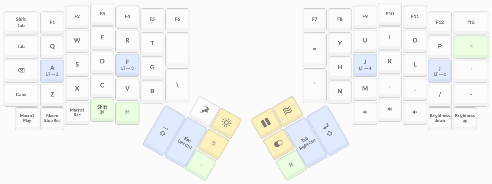
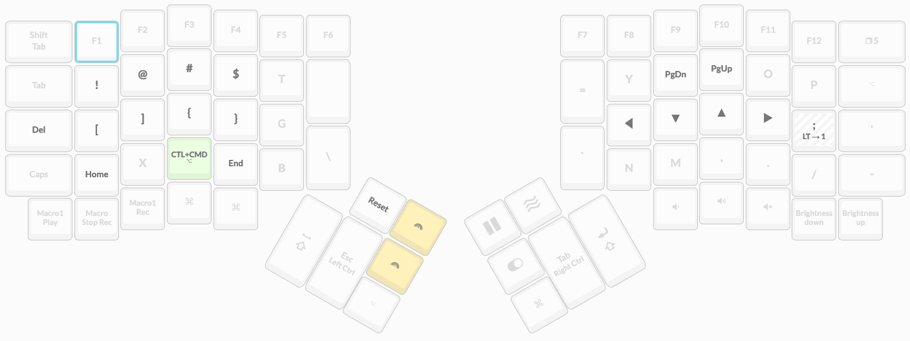
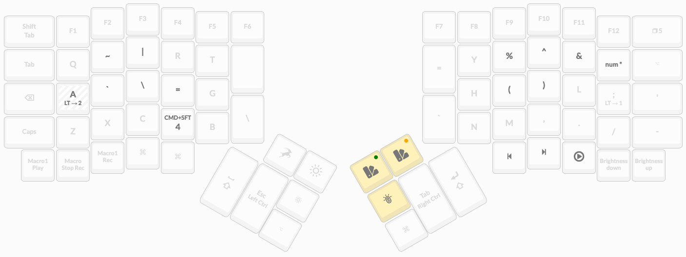
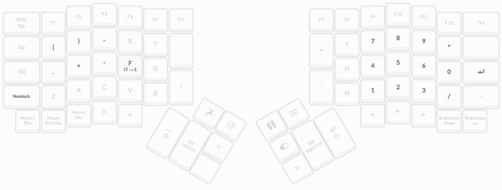
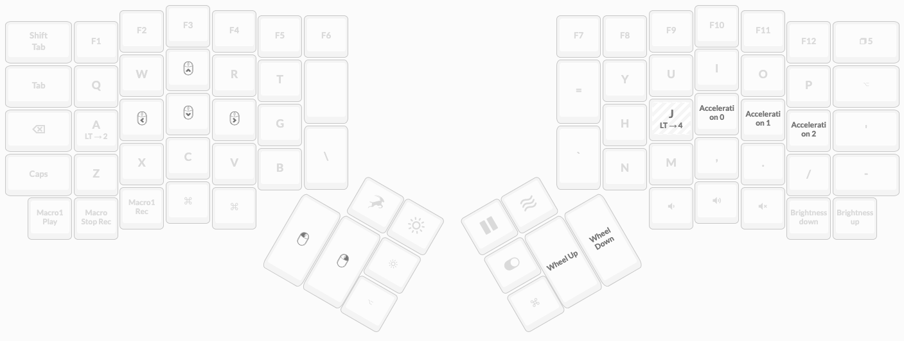
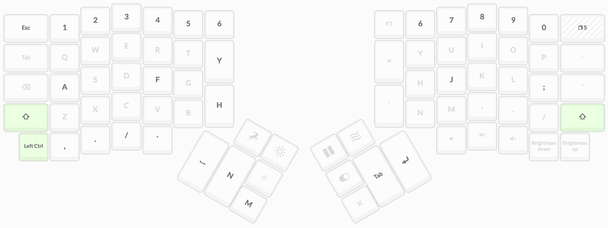

## ErgoDox Base (Reachless Layout)

An [ErgoDox](https://www.ergodox.io/) layout focused on keeping everything needed for writing code on, or close to, the home row, to reduce fatigue caused by reaching for keys.

I use this daily with my [ErgoDox-EZ Shine](https://ergodox-ez.com/), and tweak/add new things to it all the time.

### Layers

There are 6 layers on this layout:
- Base layer
  - Trigger: Default
  - Close to a normal QWERTY layout
- Left Symbols
  - Trigger: Holding `;`
  - Makes common symbols available around the left side home row, puts arrow keys in a Vim-like arrangement on the right home row
- Right Symbols
  - Trigger: Holding `a`
  - Makes common symbols available around the right side home row, along with some less-frequently used symbols on the left home row
- Numbers
  - Trigger: Holding `f`
  - Turns the right home row and surrounding keys into a numpad, with operators on the left home row
- Mouse
  - Trigger: Holding `j`
  - Enables mouse mode, using `e`, `s`, `d`, `f` for navigation
- Game
  - Trigger: Toggle with top-right key (typical backspace location)
  - More of a basic QWERTY layout than the base layer, with all layer toggles removed

### Keymaps

#### Base

#### Left Symbols

#### Right Symbols

#### Numbers

#### Mouse

#### Game

### Building the Firmware

Instructions from ErgoDox-EZ on how this can be used below (this repo only tracks the /*/source directory)...

---

# Building your layout from source

Congratulations on taking the next step, and making use of your keyboard's open-source nature! There's so much power to unlock — this is going to be fun. :)

Here are some initial pointers to get you started:

- Use the documentation at [https://docs.qmk.fm/](https://docs.qmk.fm/) to set up your environment for building your firmware.
- Build your layout against [https://github.com/zsa/qmk_firmware/](https://github.com/zsa/qmk_firmware/) which is our QMK fork (instead of qmk/qmk_firmware). This is what Oryx (the graphical configurator) uses, so it's guaranteed to work.
- Create a folder with a simple name (no spaces!) for your layout inside the qmk_firmware/keyboards/ergodox_ez/keymaps/ folder.
- Copy the contents of the \*\_source folder (in the .zip you downloaded from Oryx) into this folder.
- Make sure you've set up your environment per the [QMK docs](https://docs.qmk.fm/#/newbs_getting_started?id=set-up-your-environment) so compilation would actually work.
- From your shell, make sure your working directory is qmk*firmware, then enter the command `make ergodox_ez:_layout_`, substituting the name of the folder you created for "_layout_".

Good luck on your journey! And remember, if you get stuck, you can always get back to your [original layout](https://configure.ergodox-ez.com/ergodox-ez/layouts/nmyxJ/0KGR4/0) from Oryx.
